# 🎓 Hướng Dẫn Sử Dụng Hệ Thống Trợ Lý Giảng Dạy AI (AI Teaching Assistant)

Chào mừng thầy/cô đến với **AI Teaching Assistant**! Hệ thống là một trợ lý thông minh toàn diện, ứng dụng công nghệ AI tiên tiến (Gemini, Imagen, Text-to-Speech) để hỗ trợ giảng viên thiết kế bài giảng tự động từ dàn ý thô thành các tài nguyên giáo dục chất lượng cao như: slide PowerPoint (PPTX) chuyên nghiệp, lời giảng thuyết minh (speaker notes), file âm thanh thuyết minh (audio), ngân hàng câu hỏi đánh giá theo thang đo Bloom, và video bài giảng hoạt cảnh (Manim animation) sống động.

Tài liệu này sẽ hướng dẫn thầy/cô từng bước chi tiết từ lúc khởi tạo tài khoản đến khi tạo môn học, bài học, và đi qua toàn bộ quy trình 6 bước thiết kế bài giảng, cũng như luồng xuất video bài giảng tự động.

---

## 📋 MỤC LỤC
1. [Khởi Động & Đăng Ký/Đăng Nhập Tài Khoản](#1-khởi-động--đăng-kýđăng-nhập-tài-khoản)
2. [Thiết Lập API Keys & AI Config](#2-thiết-lập-api-keys--ai-config)
3. [Tạo Mới & Quản Lý Môn Học (Subjects)](#3-tạo-mới--quản-lý-môn-học-subjects)
4. [Tạo Mới Bài Giảng (Lessons)](#4-tạo-mới-bài-giảng-lessons)
5. [Quy Trình 6 Bước Thiết Kế Bài Giảng Chi Tiết (Workflow Editor)](#5-quy-trình-6-bước-thiết-kế-bài-giảng-chi-tiết-workflow-editor)
   - [Bước 1: Nhập Outline Thô (Step 1: Nhập Outline)](#bước-1-nhập-outline-thô)
   - [Bước 2: Tạo Outline Chi Tiết (Step 2: Tạo Outline Chi Tiết)](#bước-2-tạo-outline-chi-tiết)
   - [Bước 3: Thiết Kế Slide (Step 3: Kịch Bản Slide)](#bước-3-thiết-kế-slide)
   - [Bước 4: Lời Giảng & Audio (Step 4: Tạo Audio)](#bước-4-lời-giảng--audio)
   - [Bước 5: Tạo PowerPoint (Step 5: Tạo PPTX)](#bước-5-tạo-powerpoint)
   - [Bước 6: Ngân Hàng Câu Hỏi (Step 6: Ngân Hàng Câu Hỏi)](#bước-6-ngân-hàng-câu-hỏi)
6. [Luồng Tạo Video Bài Giảng Hoạt Cảnh Tự Động (Video Generator)](#6-luồng-tạo-video-bài-giảng-hoạt-cảnh-tự-đồng-video-generator)
7. [Các Lưu Ý Quan Trọng Khi Sử Dụng](#7-các-lưu-ý-quan-trọng-khi-sử-dụng)

---

## 1. KHỞI ĐỘNG & ĐĂNG KÝ/ĐĂNG NHẬP TÀI KHOẢN

### 1.1 Đăng ký tài khoản mới (`/register`)
Khi bắt đầu sử dụng hệ thống lần đầu tiên, thầy/cô cần tạo tài khoản:
1. Truy cập vào địa chỉ Frontend của ứng dụng (mặc định tại máy local là `http://localhost:3000` hoặc `http://localhost:5173`).
2. Nhấp chọn **Đăng ký (Register)** trên màn hình.
3. Điền đầy đủ thông tin:
   - **Họ và tên / Tên hiển thị**.
   - **Email** (sử dụng để đăng nhập).
   - **Mật khẩu** (tối thiểu 6 ký tự).
4. Nhấn **Đăng ký** để hoàn tất. Hệ thống sẽ tự động đăng ký và dẫn thầy/cô đến trang Đăng nhập.

### 1.2 Đăng nhập hệ thống (`/login`)
1. Nhập **Email** và **Mật khẩu** đã đăng ký.
2. Nhấn **Đăng nhập**. Hệ thống sử dụng cơ chế xác thực bảo mật JWT, sau khi đăng nhập thành công thầy/cô sẽ được chuyển hướng trực tiếp về giao diện chính **My Subjects (Môn học của tôi)**.

---

## 2. THIẾT LẬP API KEYS & AI CONFIG

Trước khi để AI làm việc hiệu quả, hệ thống cần được cấu hình các API Key của bên thứ ba để kích hoạt các tính năng tạo văn bản, vẽ tranh và thuyết minh giọng đọc.

> [!IMPORTANT]
> Cấu hình API Key và cấu hình Model Preference có thể thực hiện tại trang **UserSettings (`/settings`)** hoặc trang quản lý **ApiKeysPage (`/admin/api-keys`)**.

### 2.1 Cấu hình API Keys (`/settings` hoặc `/admin/api-keys`)
Thầy/cô cần cung cấp hoặc kiểm tra các khóa API sau:
* **Gemini API Key**: Dành cho việc suy luận nội dung văn bản, tạo kịch bản chi tiết và câu hỏi ôn tập (Model ưu tiên: `gemini-2.5-pro` hoặc `gemini-2.5-flash`).
* **Imagen API Key**: Dành cho việc sinh hình ảnh minh họa chất lượng cao cho từng slide (Model ưu tiên: `imagen-3.0`).
* **TTS Provider (Google TTS / Vbee / viTTS)**: Cấu hình giọng đọc thuyết minh.
  - *Google TTS*: Yêu cầu file JSON Credentials của GCP.
  - *Vbee / viTTS*: Điền Token/API Key được cung cấp để hỗ trợ tiếng Việt tự nhiên chất lượng cao.

### 2.2 Cấu hình AI Model Preferences
Trong trang **Settings (Cài đặt)**, giảng viên có thể chỉ định model AI cụ thể cho từng tác vụ giảng dạy nhằm tối ưu hóa chi phí hoặc tốc độ:
* **Tác vụ OUTLINE (Dàn ý)**: Mặc định khuyên dùng `gemini-2.5-pro` để có cấu trúc logic sâu sắc nhất.
* **Tác vụ SLIDES (Soạn slide)**: Mặc định khuyên dùng `gemini-2.5-pro` để diễn đạt ý cô đọng, sáng tạo.
* **Tác vụ QUESTIONS (Tạo quiz)**: Dùng `gemini-2.5-flash` hoặc `gemini-2.5-pro`.
* **Tác vụ IMAGE (Sinh ảnh AI)**: Dùng `imagen-3.0`.

---

## 3. TẠO MỚI & QUẢN LÝ MÔN HỌC (SUBJECTS)

Giao diện trang chủ (`/`) là nơi quản lý toàn bộ các môn học của thầy/cô dưới dạng thẻ (Subject Cards) trực quan.

### 3.1 Tạo môn học mới
1. Tại trang chủ, nhấp chọn nút **+ New Subject** (hoặc **Tạo môn học**).
2. Form **Tạo môn học mới** sẽ hiện ra với các trường thông tin sau:
   - **Tên môn học\***: Tên viết tắt hoặc tên chính (VD: *Lập trình cơ bản*, *Toán cao cấp*).
   - **Mô tả ngắn**: Giới thiệu khái quát về môn học.
   - **Thông tin cho AI (AI Role Context)**:
     - **Loại tổ chức**: Chọn từ danh sách (Đại học, Cao đẳng, THPT, Doanh nghiệp, Khác).
     - **Ngành học**: (VD: *Công nghệ thông tin*, *Khoa học dữ liệu*).
     - **🌐 Ngôn ngữ đầu ra**:
       - *Tiếng Việt*: Toàn bộ slide và thuyết minh bằng tiếng Việt.
       - *English*: Toàn bộ bằng tiếng Anh.
       - *Song ngữ (Bilingual)*: Tiêu đề và nội dung slide bằng tiếng Anh, kịch bản thuyết minh (Speaker Notes) viết bằng tiếng Việt.
     - **Lĩnh vực chuyên môn**: Lĩnh vực hẹp (VD: *Trí tuệ nhân tạo*, *Lập trình Python*).
     - **Tên môn học đầy đủ**: (VD: *Nhập môn lập trình với Python*).
     - **Đối tượng học viên**: (VD: *Sinh viên năm nhất đại học*).
     - **Yêu cầu bổ sung (Tùy chọn)**: Nhập các lưu ý đặc biệt để AI tuân thủ (VD: *Tránh học thuật quá nặng, đưa nhiều ví dụ thực tế doanh nghiệp vào nội dung*).
3. Nhấn nút **Tạo môn học** để lưu lại.

> [!TIP]
> **AI Role Context** là tính năng cực kỳ đắt giá của hệ thống. Nhờ các thông tin chi tiết này, AI sẽ đóng vai chính xác giảng viên của tổ chức đó và cá nhân hóa giọng điệu, mức độ kiến thức cũng như ví dụ phù hợp nhất cho đối tượng người học mục tiêu.

### 3.2 Khám phá chi tiết môn học (`/subjects/:id`)
Khi nhấp vào một môn học, thầy/cô sẽ chuyển đến trang quản trị môn học với 3 Tab chức năng chính:
1. **📋 Đề cương (Syllabus)**: Tạo, nhập và quản lý khung chương trình tổng thể của toàn bộ môn học.
2. **📚 Bài giảng (Lessons)**: Nơi chứa danh sách tất cả các bài học chi tiết của môn học đó.
3. **🎬 Video**: Nơi quản lý, theo dõi lịch sử sinh các video hoạt cảnh của môn học.

---

## 4. TẠO MỚI BÀI GIẢNG (LESSONS)

Từ trang chi tiết môn học, thầy/cô chuyển qua Tab **📚 Bài giảng** để bắt đầu xây dựng bài học mới.

### Các bước tạo bài giảng:
1. Nhấp nút **+ Tạo bài giảng**.
2. Một Modal popup xuất hiện hỗ trợ 2 phương pháp:
   * **Phương án A: Tạo bài giảng từ Đề cương (Syllabus Bridge)**: Hệ thống sẽ tự động liệt kê các bài học chưa được liên kết từ Đề cương chi tiết (nếu đã cấu hình bên Tab Đề cương). Chọn một bài học có sẵn, hệ thống sẽ tự động nạp tiêu đề và toàn bộ phân rã nội dung từ đề cương sang.
   * **Phương án B: Tạo bài giảng thủ công**: Nhập trực tiếp tiêu đề bài giảng vào ô **Tên bài giảng** (VD: *Chương 1: Giới thiệu chung về Lập trình Python*).
3. Nhấp chọn **Tạo & Bắt đầu sửa**. 
4. Hệ thống sẽ ngay lập tức khởi tạo bài giảng ở trạng thái Draft và tự động chuyển hướng thầy/cô vào giao diện **Workflow Editor 6 bước** chuyên sâu (`/lessons/:id`).

---

## 5. QUY TRÌNH 6 BƯỚC THIẾT KẾ BÀI GIẢNG CHI TIẾT (WORKFLOW EDITOR)

Giao diện Soạn thảo v2 (`LessonEditorPageV2`) được thiết kế với thanh tiến trình Stepper trực quan ở đầu trang cùng bộ nút điều hướng **← Quay lại** và **Tiếp theo →** ở chân trang giúp giảng viên dễ dàng làm chủ quy trình 6 bước.

```mermaid
flowchart LR
    Step1[1. Nhập Outline Thô] --> Step2[2. Outline Chi Tiết]
    Step2 --> Step3[3. Kịch Bản Slide]
    Step3 --> Step4[4. Lời Giảng & Audio]
    Step4 --> Step5[5. Tạo PowerPoint]
    Step5 --> Step6[6. Ngân Hàng Câu Hỏi]
    style Step1 fill:#1e293b,stroke:#3b82f6,stroke-width:2px,color:#f8fafc
    style Step2 fill:#1e293b,stroke:#3b82f6,stroke-width:2px,color:#f8fafc
    style Step3 fill:#1e293b,stroke:#3b82f6,stroke-width:2px,color:#f8fafc
    style Step4 fill:#1e293b,stroke:#3b82f6,stroke-width:2px,color:#f8fafc
    style Step5 fill:#1e293b,stroke:#3b82f6,stroke-width:2px,color:#f8fafc
    style Step6 fill:#1e293b,stroke:#3b82f6,stroke-width:2px,color:#f8fafc
```



---

### Bước 1: Nhập Outline Thô
Bước này giúp thầy/cô định hình các đề mục chính sẽ xuất hiện trong bài giảng.

1. **Nhập nội dung**: Gõ hoặc dán (Copy-paste) dàn ý thô của bài giảng vào khung nhập liệu lớn. Thầy/cô có thể định dạng dàn ý theo cấu trúc phân cấp markdown đơn giản.
   * *Ví dụ nhập liệu:*
     ```markdown
     # Bài 01: Làm quen với lập trình Python
     1. Lập trình là gì?
     2. Tại sao chọn Python?
     3. Cài đặt Python & VS Code
     4. Viết chương trình đầu tiên: Hello World
     5. Biến số và các phép toán cơ bản
     ```
2. **Lưu dữ liệu**: Bấm nút **💾 Lưu Outline** ở góc trên bên phải.
3. Khi lưu thành công, nhấn **Tiếp theo →** ở chân trang để chuyển sang Bước 2.

---

### Bước 2: Tạo Outline Chi Tiết
Từ dàn ý thô sơ lược của Bước 1, AI sẽ phân tích và lập kế hoạch sư phạm cực kỳ chi tiết cho toàn bộ buổi học.

1. **Sinh dữ liệu với AI**:
   - Chọn model AI thích hợp trên thanh chọn nhanh (Khuyên dùng: `gemini-2.5-pro`).
   - Nhấp nút **🤖 Tạo với AI**. Quá trình suy luận sẽ diễn ra trong khoảng 30-60 giây.
2. **Nội dung sinh ra bao gồm**:
   - **Mục tiêu bài học (Objectives)**: Mô tả sinh viên sẽ đạt được gì (kiến thức, kỹ năng) sau bài học.
   - **Nội dung chính (Agenda)**: Dàn ý khoa học được AI cấu trúc lại rõ ràng.
   - **Hướng dẫn học tập (Learning Guide)**: Các thiết bị cần chuẩn bị, tài liệu tham khảo và phương pháp học.
   - **Tình huống mở đầu (Opening Situation)**: Đưa ra một tình huống thực tiễn sinh động hoặc bài toán thực tế cần giải quyết đầu giờ để khơi gợi hứng thú của người học.
   - **Chi tiết các phần (Content Sections)**: Phân rã sâu từng mục chính thành các mục con kèm diễn giải nội dung chi tiết.
   - **Giải pháp tình huống (Situation Solution)**: Lời giải cho bài toán đặt ra ở phần mở đầu bài.
   - **Tóm tắt (Summary)** & **Câu hỏi thảo luận (Discussion Questions)**.
3. **Xem & Chỉnh sửa**:
   - Chế độ **👁️ Xem đẹp**: Giúp thầy/cô duyệt nhanh nội dung hiển thị trực quan, phân chia theo các khối màu và icon sinh động.
   - Chế độ **⚙️ Sửa JSON**: Nếu thầy/cô muốn tùy biến sâu cấu trúc dàn ý chi tiết này, nhấp chọn **⚙️ Sửa JSON**, sửa đổi nội dung text trực tiếp trong file JSON có cấu trúc và bấm **💾 Lưu thay đổi**.

> [!WARNING]
> Khi ở chế độ **⚙️ Sửa JSON**, thầy/cô cần đảm bảo không làm hỏng cú pháp dấu ngoặc nhọn `{}` hay ngoặc vuông `[]` của JSON. Hệ thống sẽ tự động xác thực (Validate) cấu trúc JSON trước khi cho phép lưu.

---

### Bước 3: Thiết Kế Slide
Hệ thống sẽ chuyển dịch toàn bộ dàn bài chi tiết ở Bước 2 thành kịch bản phân cảnh chi tiết cho từng trang slide.

1. **Tạo kịch bản**: Nhấp chọn nút **🤖 Tạo Kịch Bản**.
2. AI sẽ tự động phân tách bài giảng thành một chuỗi các slide có thứ tự logic gồm: *Slide tiêu đề, Slide mục tiêu, các Slide nội dung cốt lõi, Slide tình huống, Slide tóm tắt, v.v.*
3. **Các trường thông tin thiết kế của mỗi Slide**:
   - **Slide Type**: Loại slide (Title, Content, Transition, BigStat...).
   - **Tiêu đề**: Tiêu đề ngắn gọn của slide.
   - **Nội dung (Content)**: Các gạch đầu dòng (bullets) cô đọng, súc tích tối đa.
   - **Visual Idea (Ý tưởng hình ảnh)**: AI gợi ý chi tiết bức tranh hoặc biểu đồ cần vẽ để diễn tả trực quan thông điệp của slide.
4. **Các chế độ hiển thị linh hoạt**:
   - **📋 Bảng**: Hiển thị kịch bản dạng hàng ngang tiện so sánh và đối chiếu.
   - **📊 Cards**: Trực quan hóa kịch bản dưới hình thức từng tấm thẻ giống như trang slide thật, giúp xem bố cục và ý tưởng hình ảnh dễ dàng.
   - **Preview**: Định dạng tài liệu văn bản để đọc liền mạch.
   - **⚙️ Sửa JSON**: Cho phép sửa trực tiếp kịch bản thô của AI.
5. **Sinh hình ảnh minh họa bằng AI**:
   - Nếu kịch bản đã sinh ra các `Visual Idea`, nút **🖼️ Tạo Hình Ảnh** sẽ sáng lên.
   - Nhấp chọn **🖼️ Tạo Hình Ảnh** để kích hoạt Imagen 3.0 tự động vẽ tranh minh họa chất lượng cao cho tất cả các slide. Hình ảnh sẽ tự động nhúng vào slide tương ứng.

---

### Bước 4: Lời Giảng & Audio
Bước này biến giáo án tĩnh thành kịch bản thuyết minh động bằng cách tạo lời giảng giảng viên (Speaker Notes) và giọng đọc nhân tạo (Text-To-Speech) tương ứng.

#### 4.1 Tạo & Tối ưu hóa kịch bản lời giảng (Speaker Notes)
Quy trình tạo Speaker Notes được thiết kế theo chuẩn 2 lớp cực kỳ chặt chẽ:
1. **Lớp 1 - Tạo lời giảng**: Nhấp nút **✨ Tạo Lời Giảng** để AI viết kịch bản hướng dẫn chi tiết cho từng slide dựa trên nội dung slide.
2. **Lớp 2 - Tối ưu & Kiểm duyệt**: Nhấp nút **✅ Tối Ưu & Kiểm Duyệt**. AI sẽ chạy một quy trình QA kiểm duyệt chuyên sâu: sửa các lỗi diễn đạt thô, chuẩn hóa cách đọc các thuật ngữ khoa học/tiếng Anh, bổ sung các từ đệm tự nhiên như *"Kính chào các em"*, *"Tiếp theo chúng ta hãy cùng..."*, đảm bảo câu từ mượt mà nhất khi đưa vào máy đọc TTS.

> [!TIP]
> Giảng viên có thể nhấp vào biểu tượng chiếc bút chì **✏️** trên cột **Lời Giảng (Tối Ưu)** của từng slide để trực tiếp chỉnh sửa câu từ thuyết minh theo phong cách riêng của mình, sau đó bấm **💾 Lưu**.

#### 4.2 Cấu hình & Tạo âm thanh thuyết minh (Audio TTS)
1. **Cấu hình giọng đọc (TTS Selector)**:
   - Hệ thống hỗ trợ tích hợp giọng đọc chất lượng cao từ nhiều nhà cung cấp (Google Cloud TTS, Vbee...).
   - Thầy/cô chọn ngôn ngữ, chọn giọng đọc nam/nữ ấm áp phù hợp và điều chỉnh tốc độ đọc (mặc định: `1.0x`).
2. **Tạo audio thuyết minh**:
   - **Cách 1: Tạo đơn lẻ**: Trên từng thẻ slide, nhấn **🎙️ Tạo Audio** để tạo file đọc cho riêng slide đó.
   - **Cách 2: Tạo hàng loạt**: Nhấn **🎙️ Tạo Audio Tất Cả** ở thanh công cụ chính để hệ thống tự động chạy ngầm tạo audio cho toàn bộ bài học. Có nút **⏹️ Dừng** để dừng tiến trình bất kỳ lúc nào.
3. **Ghi âm trực tiếp bằng giọng của giảng viên (Voice Recording)**:
   - Nếu thầy/cô muốn sử dụng chính giọng đọc thật của mình thay vì AI:
   - Nhấn nút **🎤 Ghi âm** trên thẻ slide đó.
   - Bắt đầu nói thông qua micro của máy tính.
   - Khi nói xong, nhấn **⏹️ Dừng ghi** để hệ thống tự động tải file ghi âm lên máy chủ và nhúng vào slide đó làm âm thanh thuyết minh (âm thanh ghi âm sẽ hiển thị nhãn `🎤 Ghi âm`).
4. **Quản lý âm thanh**:
   - Sau khi tạo thành công, trình phát nhạc mini sẽ hiện ra giúp thầy/cô nghe thử (phát `▶️` / dừng `⏹️`).
   - Có thể tải file âm thanh thuyết minh đơn lẻ (`📥`) hoặc nhấp **📥 Tải Tất Cả Audio (ZIP)** ở chân trang để tải toàn bộ bài học.

---

### Bước 5: Tạo PowerPoint
Hệ thống tổng hợp tất cả các sản phẩm trung gian (nội dung, ảnh AI, audio thuyết minh) ở các bước trước để xuất bản ra tệp trình chiếu PowerPoint `.pptx` hoàn chỉnh.

1. **Chọn mẫu PowerPoint (Template Selector)**:
   - Chọn một trong các theme/template có sẵn từ danh sách thả xuống. Mỗi mẫu sẽ hiển thị hình ảnh xem trước (Preview) của ảnh nền trang tiêu đề (Title BG) và ảnh nền trang nội dung (Content BG).
2. **Tối ưu hóa hình ảnh & nội dung trang slide**:
   - Nhấp nút **🚀 Tạo nội dung PPTX** (hoặc **Tạo lại nội dung**).
   - Hệ thống sẽ hiển thị một tiến trình chạy tròn thể hiện phần trăm hoàn thành. Mỗi trang slide sẽ được xử lý: tối ưu bố cục chữ kèm emoji tương ứng cho từng gạch đầu dòng, ghép ảnh Imagen 3.0 đã tạo.
   - *Tính năng sửa đổi tại chỗ*: Sau khi chạy xong, trên danh sách xem trước các slide bên dưới, thầy/cô có thể nhấp **🔄 Tạo lại nội dung** hoặc **🖼️ Tạo lại ảnh** cho một trang slide cụ thể nếu thấy bố cục hoặc ảnh vẽ chưa ưng ý mà không cần làm lại từ đầu cả bài.
3. **Đóng gói và tải file PPTX về máy**:
   - Nhấn **📦 Tạo PPTX (có Audio)** để đóng gói file PPTX nhúng sẵn âm thanh thuyết minh của từng slide. Sau khi đóng gói hoàn tất, nút sẽ chuyển thành **📥 Tải PPTX (có Audio)** để thầy/cô tải xuống.
   - Nhấn **📦 Tạo PPTX (không Audio)** nếu thầy/cô chỉ cần file slide trình chiếu tĩnh thông thường.

---

### Bước 6: Ngân Hàng Câu Hỏi
AI giúp giảng viên soạn thảo một hệ thống câu hỏi đánh giá người học chất lượng cao bám sát nội dung bài học.

Thầy/cô chọn lựa giữa 2 loại câu hỏi qua hai Tab chuyên biệt:

#### Tab 1: 🎯 Câu hỏi Tương tác (Interactive Questions)
Là dạng câu hỏi ngắn xuất hiện xen kẽ ngay trong quá trình giảng dạy nhằm duy trì sự tập trung của người học.
* **Đặc điểm**:
  - Số lượng khuyến nghị: 5 câu hỏi/bài.
  - Loại câu hỏi: Trắc nghiệm một đáp án đúng (MC) hoặc nhiều đáp án đúng (MR).
  - Hỗ trợ tối đa lên đến 10 phương án lựa chọn. Phương án đúng được đánh dấu bằng ký tự `*` ở đầu phương án trong chế độ sửa.
  - Tích hợp phản hồi chi tiết (Feedback): hiển thị lời khen/giải thích khi sinh viên làm **Đúng (Correct Feedback)** hoặc gợi ý ôn tập khi sinh viên làm **Sai (Incorrect Feedback)**.
* **Thao tác**: Nhập số lượng mong muốn và bấm **🤖 Tạo Câu Hỏi Tương Tác**. Giảng viên có thể nhấp **✏️ Sửa** để đổi câu chữ, phương án trả lời trực tiếp hoặc sửa phản hồi Đúng/Sai.

#### Tab 2: 📝 Câu hỏi Ôn tập (Bloom Taxonomy)
Là kho câu hỏi ôn tập tổng hợp cuối bài được phân loại chuẩn xác theo 3 cấp độ nhận thức của Thang đo Bloom.
* **Đặc điểm**:
  - **Mức độ 1 - Biết (Remember)**: Nhận biết khái niệm, thông tin cốt lõi.
  - **Mức độ 2 - Hiểu (Understand)**: Giải thích, phân biệt được bản chất vấn đề.
  - **Mức độ 3 - Vận dụng (Apply)**: Giải quyết các bài toán tình huống thực tế.
  - Bố cục đáp án: Gồm 4 phương án (A, B, C, D) trong đó **đáp án A luôn là đáp án đúng** (khi giảng viên xuất tệp ra, hệ thống sẽ tự động xáo trộn ngẫu nhiên thứ tự đáp án để đảm bảo tính khách quan).
  - Có phần giải thích chi tiết (Explanation) tại sao đáp án A đúng.
* **Thao tác**:
  - Nhập số lượng câu hỏi mong muốn cho từng cấp độ (VD: *20 câu Biết, 20 câu Hiểu, 10 câu Vận dụng*).
  - Nhấn **🤖 Tạo Mới (Xóa cũ)** để tạo ngân hàng câu hỏi mới.
  - Nhấn **➕ Tạo Thêm (Giữ cũ)** nếu muốn bổ sung thêm câu hỏi mới vào kho câu hỏi hiện có mà không làm mất đi các câu hỏi đã biên tập trước đó.

#### 📊 Xuất dữ liệu câu hỏi (Export capabilities)
Thầy/cô có thể tải kho câu hỏi này về máy bằng các định dạng chuyên dụng:
* **Xuất Excel Tương tác / Ôn tập**: Tải file bảng tính `.xlsx` chuẩn hóa để lưu trữ hoặc in ấn.
* **Xuất Moodle XML**: Xuất tệp tin định dạng `.xml` tiêu chuẩn giúp giảng viên import trực tiếp hàng loạt câu hỏi vào ngân hàng đề thi của hệ thống học tập LMS Moodle hoặc Canvas chỉ trong 3 giây.

---

## 6. LUỒNG TẠO VIDEO BÀI GIẢNG HOẠT CẢNH TỰ ĐỘNG (VIDEO GENERATOR)

Đây là một trong những tính năng đột phá và độc đáo nhất của hệ thống, cho phép thầy/cô biến toàn bộ bài giảng (văn bản slide + lời thoại audio) thành một video bài giảng sinh động mà không cần kỹ năng biên tập video chuyên nghiệp.

> [!TIP]
> Để truy cập công cụ tạo video, tại màn hình soạn thảo bài giảng Bước 3, 4 hoặc 5, thầy/cô nhấp chọn nút **🎬 Tạo Video** màu xanh dương ở góc trên bên phải tiêu đề bài học. Màn hình **Video Studio (VideoGeneratorPage)** sẽ xuất hiện.

```
       [ Kịch bản kịch tính từ bài học ]
                      │
                      ▼
        [ Phân loại & Lựa chọn Approach ]
       ┌──────────────┬──────────────┬──────────────┐
       │              │              │              │
    (Manim)     (Playwright)     (Imagen 3)      (Static)
       │              │              │              │
       ▼              ▼              ▼              ▼
  [Animation]    [Screencast]    [AI Image]     [Ken Burns]
       │              │              │              │
       └──────────────┼──────────────┴──────────────┘
                      │
                      ▼
         [ viTTS Sinh Giọng Nói Thuyết Minh ]
                      │
                      ▼
        [ FFmpeg Trộn & Đồng Bộ Phụ Đề ]
                      │
                      ▼
          [ Video MP4 Hoàn Chỉnh ]
```

### 6.1 Cơ chế dựng hình Hybrid Video Pipeline
Để tạo ra các chuyển cảnh mượt mà và trực quan, hệ thống tự động phân loại nội dung từng trang slide và áp dụng cách dựng hình (Approach) phù hợp nhất:
1. **Manim Engine**: Đối với các slide chứa công thức toán học phức tạp, đồ thị hàm số, biểu đồ thống kê hoặc sơ đồ khối, AI tự động lập trình mã nguồn Python Manim để render ra các hiệu ứng vẽ hình vẽ công thức chuyển động cực kỳ bắt mắt (phong cách giống như kênh Youtube nổi tiếng 3Blue1Brown).
2. **Playwright Engine**: Đối với các bài giảng lập trình hoặc hướng dẫn thao tác phần mềm, hệ thống giả lập một trình duyệt Chromium không đầu, tự động ghi hình lại quá trình gõ từng ký tự code trên màn hình IDE mô phỏng hay gõ lệnh trên Terminal.
3. **Imagen 3 Engine**: Với các slide mô tả ý tưởng trừu tượng cần tính nghệ thuật, AI dùng Imagen 3 để vẽ tranh và áp dụng hiệu ứng camera zoom chuyển động mượt mà.
4. **Static Engine**: Với các slide chứa danh sách chữ đơn giản, hệ thống tạo video tĩnh chất lượng cao kết hợp hiệu ứng Ken Burns nhẹ nhàng để người học không bị mỏi mắt.

### 6.2 Các bước tạo video bài giảng:
1. **Cấu hình Video**: Điền các tùy chọn trong bảng **ConfigPanel**:
   - **Độ phân giải (Resolution)**: Chọn chất lượng xuất video (480p, 720p, 1080p, 4K).
   - **Định dạng khung hình (Format)**:
     - *16:9 (Ngang)*: Thích hợp chiếu trên lớp, đăng Youtube, đưa lên LMS.
     - *9:16 (Dọc)*: Định dạng tối ưu cho video ngắn trên TikTok, Facebook Reels, Youtube Shorts.
   - **Ngôn ngữ thuyết minh (Narration)**: Tiếng Việt hoặc Tiếng Anh.
   - **Phụ đề video (Subtitle)**: Lựa chọn hiển thị phụ đề chạy dưới màn hình: *Tiếng Việt, Tiếng Anh, Song ngữ (Bilingual)* hoặc *Không phụ đề*.
   - **Tốc độ đọc**: Tùy chỉnh độ nhanh/chậm của giọng đọc thuyết minh (0.8x, 1.0x, 1.2x, 1.5x).
2. **Bắt đầu tạo video**: Nhấn nút **🚀 Tạo Video**.
3. **Theo dõi tiến trình trực quan (ProgressTracker)**:
   - Giao diện sẽ hiển thị thanh phần trăm tổng quan kèm danh sách trạng thái chi tiết của từng scene (tương ứng với mỗi slide).
   - WebSocket kết nối realtime sẽ báo rõ cho thầy/cô biết hệ thống đang xử lý tác vụ gì ở mỗi giây: *Đang thiết kế kịch bản video, Đang viết code hoạt cảnh, Đang chạy render Manim, Đang tổng hợp âm thanh, Đang ghép nối video...*
   - *Tính năng tự phục hồi (Fallback)*: Nếu trong quá trình render, một hoạt cảnh Manim hoặc Playwright bị lỗi lập trình, hệ thống sẽ tự động phát hiện và chuyển đổi thông minh sang cơ chế Static/Imagen để đảm bảo tiến trình tạo video không bị gián đoạn và luôn xuất ra sản phẩm thành công.
4. **Thưởng thức và tải sản phẩm**:
   - Khi tiến trình đạt 100%, trình phát video HTML5 cao cấp sẽ hiển thị tại chỗ để thầy/cô xem thử chất lượng video hoạt cảnh và âm thanh đồng bộ.
   - Nhấn **📥 Tải Video** để tải tệp tin định dạng `.mp4` chất lượng cao về máy tính.
   - Nhấn **📥 Tải Phụ Đề** để tải file phụ đề định dạng `.srt` phục vụ cho việc biên tập ngoài nếu có nhu cầu.

---

## 7. CÁC LƯU Ý QUAN TRỌNG KHI SỬ DỤNG

* 🌐 **Kết nối mạng & API keys**: Hãy đảm bảo các khóa API luôn còn hạn sử dụng và số dư tài khoản đủ để thực hiện các yêu cầu dịch vụ của Google Gemini và Imagen.
* 🎙️ **Tốc độ sinh Audio**: Khi bấm tạo audio hàng loạt ở Bước 4, hệ thống tự động cấu hình cơ chế trễ (delay) từ 2-5 giây giữa các slide để tuân thủ giới hạn băng thông (Rate Limit) của các nhà cung cấp dịch vụ TTS, tránh hiện tượng nghẽn IP. Thầy/cô vui lòng kiên nhẫn chờ cho đến khi tiến trình hoàn tất.
* ⚙️ **Dịch vụ bổ trợ (PPTX Service)**: Slide PowerPoint được xây dựng dựa trên một động cơ Python chuyên dụng. Hãy đảm bảo cổng dịch vụ `port 3002` luôn được mở và chạy ổn định ở môi trường máy chủ backend để việc xuất file `.pptx` diễn ra trơn tru.
* ⚠️ **Kiểm tra quyền truy cập microphone**: Khi thực hiện tính năng **Ghi âm trực tiếp** tại Bước 4, trình duyệt sẽ yêu cầu quyền truy cập vào micro thiết bị của thầy/cô. Hãy nhấp **Cho phép (Allow)** để tính năng thu âm hoạt động chính xác.

Chúc thầy/cô có những trải nghiệm soạn thảo bài giảng tuyệt vời và nhàn nhã cùng **AI Teaching Assistant**! Nếu gặp bất kỳ sự cố kỹ thuật nào trong quá trình vận hành, hãy liên hệ ngay với bộ phận quản trị hệ thống để nhận trợ giúp.
