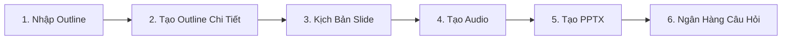

# 🎓 AI Teaching Assistant - Project Overview

> Hệ thống tạo bài giảng tự động sử dụng AI (Gemini, Imagen, TTS) để generate PPTX, handouts, và quizzes từ outline.

---

## 📋 Mục lục
- [Tech Stack](#-tech-stack)
- [Cấu trúc dự án](#-cấu-trúc-dự-án)
- [Workflow 6 bước](#-workflow-6-bước-tạo-bài-giảng)
- [Database Schema](#-database-schema)
- [Backend Modules](#-backend-modules)
- [Frontend Pages](#-frontend-pages)
- [API Endpoints](#-api-endpoints)
- [Cấu hình AI/TTS](#-cấu-hình-aitts)

---

## 🛠️ Tech Stack

| Layer | Technology |
|-------|------------|
| **Frontend** | React 18 + TypeScript + Vite |
| **Backend** | NestJS + TypeScript |
| **Database** | PostgreSQL + Prisma 7 |
| **AI Models** | Gemini 2.5 Pro/Flash |
| **Image Gen** | Imagen 3.0 |
| **TTS** | Google Cloud TTS, Vbee |
| **PPTX Export** | Python (python-pptx) |

---

## 📁 Cấu trúc dự án

```
ai-teaching-assistant/
├── backend/                    # NestJS Backend
│   ├── prisma/
│   │   └── schema.prisma       # Database schema
│   └── src/
│       ├── ai/                 # Gemini, Imagen services
│       ├── api-keys/           # API key management
│       ├── auth/               # JWT authentication
│       ├── export/             # PPTX, Word, Excel export
│       ├── lessons/            # Lesson CRUD
│       ├── model-config/       # AI model preferences
│       ├── outline/            # Step 1-2: Outline generation
│       ├── question-bank/      # Step 6: Quiz generation
│       ├── slide-audio/        # Step 4: Audio generation
│       ├── slides/             # Step 3: Slide script
│       ├── subjects/           # Subject management
│       ├── templates/          # PPTX templates
│       └── tts/                # Text-to-Speech services
│
├── frontend/                   # React Frontend
│   └── src/
│       ├── components/
│       │   ├── steps/          # Workflow step components
│       │   └── ...
│       ├── contexts/           # React contexts
│       ├── layouts/            # Page layouts
│       ├── lib/                # API clients
│       └── pages/              # Page components
│
└── pptx-generator/             # Python PPTX engine
```

---

## 🔄 Workflow 6 bước tạo bài giảng



| Step | Name | Input | Output | AI Model |
|------|------|-------|--------|----------|
| 1 | Nhập Outline | Raw text/PDF | `outlineRaw` | - |
| 2 | Tạo Outline | `outlineRaw` | `detailedOutline` | Gemini |
| 3 | Kịch Bản Slide | `detailedOutline` | `slideScript` | Gemini |
| 4 | Tạo Audio | Speaker Notes | MP3 files | TTS |
| 5 | Tạo PPTX | All above | PPTX file | Imagen + Python |
| 6 | Câu Hỏi | `detailedOutline` | Question Bank | Gemini |

---

## 🗃️ Database Schema

### Core Models

```
User (users)
├── id, email, passwordHash, role
├── apiKeys[]          # API keys cho Gemini, TTS...
├── subjects[]         # Môn học của user
└── modelConfigs[]     # Cấu hình AI model preferences

Subject (subjects)
├── id, name, description
├── userId             # Thuộc user nào
└── lessons[]          # Các bài học

Lesson (lessons)
├── id, title, status
├── outlineRaw         # Step 1: outline thô
├── detailedOutline    # Step 2: outline chi tiết (Gemini)
├── slideScript        # Step 3: kịch bản slide (Gemini)
├── currentStep        # Tiến độ (1-6)
├── templateId         # Template PPTX
├── slideAudios[]      # Audio từng slide
├── interactiveQuestions[]  # Câu hỏi tương tác (trong bài)
└── reviewQuestions[]       # Câu hỏi ôn tập (cuối bài)

SlideAudio (slide_audios)
├── slideIndex, slideTitle, speakerNote
├── audioFileName, audioUrl, audioDuration
└── status (pending/generating/done/error)

InteractiveQuestion (interactive_questions)
├── questionType       # MC (1 đáp án) | MR (nhiều đáp án)
├── questionText       # Nội dung câu hỏi
├── imageUrl/videoUrl/audioUrl  # Media (optional)
├── answer1 → answer10 # Tối đa 10 đáp án, đáp án đúng có `*`
├── correctFeedback    # Phản hồi khi đúng
├── incorrectFeedback  # Phản hồi khi sai
└── points = 1         # Điểm mỗi câu

ReviewQuestion (review_questions)
├── questionId         # B1-1-01, B1-2-03 (Bài-Level-STT)
├── level              # 1=Biết, 2=Hiểu, 3=Vận dụng (Bloom)
├── question           # Nội dung câu hỏi
├── correctAnswer      # Đáp án A (LUÔN ĐÚNG)
├── optionB/C/D        # 3 phương án nhiễu
└── explanation        # Giải thích tại sao A đúng

PPTXTemplate (pptx_templates)
├── name, titleBgUrl, contentBgUrl
├── stylingJson        # Fonts, colors, sizes
└── isSystem, isDefault
```

### Support Models
```
ApiKey          # Lưu API keys (encrypted)
ModelConfig     # User preferences cho AI tasks
TTSProvider     # Cấu hình TTS providers
UserTTSConfig   # User-specific TTS settings
```

---

## 📦 Backend Modules

| Module | Purpose | Key Files |
|--------|---------|-----------|
| `auth` | JWT login/register | `auth.service.ts`, `jwt.strategy.ts` |
| `users` | User management | `users.controller.ts` |
| `subjects` | Subject CRUD | `subjects.service.ts` |
| `lessons` | Lesson CRUD | `lessons.service.ts` |
| `outline` | Step 1-2 | `outline.service.ts`, Prompts |
| `slides` | Step 3 | `slides.service.ts`, Prompts |
| `slide-audio` | Step 4 | `slide-audio.service.ts` |
| `interactive-question` | Câu hỏi tương tác | `interactive-question.service.ts` |
| `review-question` | Câu hỏi ôn tập Bloom | `review-question.service.ts` |
| `export` | PPTX generation | `pptx-export.service.ts` |
| `ai` | Gemini, Imagen | `gemini.service.ts`, `imagen.service.ts` |
| `tts` | TTS synthesis | `tts.service.ts`, `google-tts.ts`, `vbee.ts` |
| `api-keys` | Key management | `api-keys.service.ts` |
| `model-config` | AI preferences | `model-config.service.ts` |
| `templates` | PPTX templates | `templates.service.ts` |

---

## 🖥️ Frontend Pages

| Route | Page | Description |
|-------|------|-------------|
| `/login` | LoginPage | Đăng nhập |
| `/register` | RegisterPage | Đăng ký |
| `/` | HomePage | Dashboard môn học |
| `/subjects/:id` | SubjectPage | Danh sách bài học |
| `/lessons/:id` | LessonEditorPageV2 | **Workflow Editor (6 steps)** |
| `/lessons/:id/classic` | LessonEditorPage | Classic Editor (cũ) |
| `/settings` | UserSettings | Cài đặt user |
| `/admin/api-keys` | ApiKeysPage | Quản lý API keys |
| `/admin/templates` | TemplatesPage | Quản lý templates |
| `/admin/prompts` | PromptsPage | Quản lý prompts |

### Workflow Step Components
```
Step1RawOutline      # Nhập/paste outline
Step2BuildOutline    # Generate outline chi tiết
Step3DesignSlides    # Generate kịch bản slide
Step4GenerateAudio   # Generate audio từng slide
Step5GeneratePPTX    # Generate file PPTX
Step6QuestionBank    # Generate câu hỏi
```

---

## 🔌 API Endpoints

### Auth
```
POST /auth/register     # Đăng ký
POST /auth/login        # Đăng nhập → JWT
GET  /auth/me           # Get current user
POST /auth/refresh      # Refresh token
```

### Subjects & Lessons
```
GET    /subjects                    # List subjects
POST   /subjects                    # Create subject
GET    /subjects/:id/lessons        # List lessons in subject
POST   /subjects/:id/lessons        # Create lesson
GET    /lessons/:id                 # Get lesson details
DELETE /lessons/:id                 # Delete lesson
```

### Workflow Steps
```
# Step 1-2: Outline
GET  /lessons/:id/outline                    # Get outline data
PUT  /lessons/:id/outline/raw                # Save raw outline
POST /lessons/:id/outline/generate           # Generate detailed

# Step 3: Slides
GET  /lessons/:id/slides                     # Get slide script
POST /lessons/:id/slides/generate            # Generate script
PUT  /lessons/:id/slides/script              # Update script

# Step 4: Audio
GET  /lessons/:id/slide-audio                # Get all slide audios
POST /lessons/:id/slide-audio/initialize     # Load from script
POST /lessons/:id/slide-audio/:idx/generate  # Generate single
POST /lessons/:id/slide-audio/generate-all   # Generate all
GET  /lessons/:id/slide-audio/download-all   # Download ZIP

# Step 5: PPTX Export
POST /lessons/:id/export/pptx                # Generate PPTX
GET  /lessons/:id/export/pptx/download       # Download file

# Step 6: Questions
# Interactive Questions (MC/MR, kiểm tra tập trung trong bài)
GET  /lessons/:id/interactive-questions           # List all
POST /lessons/:id/interactive-questions/generate  # Generate 5 câu
GET  /lessons/:id/interactive-questions/export    # Export table

# Review Questions (Bloom taxonomy, ôn tập cuối bài)
GET  /lessons/:id/review-questions                # List all
POST /lessons/:id/review-questions/generate       # Generate theo level
GET  /lessons/:id/review-questions/export/excel   # Export Excel
```

### Settings
```
GET  /user/settings                          # Get user settings
PUT  /user/settings                          # Update settings
GET  /user/model-config                      # Get AI config
PUT  /user/model-config/:taskType            # Set AI config
GET  /user/model-config/discover             # Discover models
```

---

## 🤖 Cấu hình AI/TTS

### Supported AI Tasks
| TaskType | Default Model | Purpose |
|----------|---------------|---------|
| `OUTLINE` | gemini-2.5-pro | Generate detailed outline |
| `SLIDES` | gemini-2.5-pro | Generate slide script |
| `QUESTIONS` | gemini-2.5-pro | Generate quiz |
| `IMAGE` | imagen-3.0 | Generate images |
| `TTS` | Google/Vbee | Text-to-Speech |

### API Keys Required
| Service | Environment Variable | Purpose |
|---------|---------------------|---------|
| Gemini | `GEMINI_API_KEY` | AI generation |
| Imagen | `IMAGEN_API_KEY` | Image generation |
| Google TTS | (via GCP credentials) | Text-to-Speech |
| Vbee | User-configured | Vietnamese TTS |

---

## 🚀 Quick Start

```bash
# Backend
cd backend
npm install
npx prisma migrate dev
npm run start:dev        # http://localhost:3001

# Frontend
cd frontend
npm install
npm run dev              # http://localhost:5173
```

---

## 📅 Planned Features (Data Restructure)

> See: `plans/260124-0928-data-structure-restructure/`

- [ ] Bảng `Slide` với các trường riêng (title, content, visualIdea, speakerNote)
- [ ] File storage user-centric (`datauser/{userId}/lessons/{lessonId}/`)
- [x] Tách `InteractiveQuestion` (MC/MR, 10 đáp án, media) - Spec done
- [x] Tách `ReviewQuestion` (Bloom taxonomy, A luôn đúng) - Spec done
- [ ] Image generation với prompt saving

---

## 📝 Question Types

### InteractiveQuestion (Câu hỏi tương tác)
> Kiểm tra sự tập trung trong suốt bài giảng

| Aspect | Value |
|--------|-------|
| Số lượng | 5 câu/bài |
| Loại | MC (1 đáp án) + MR (nhiều đáp án) |
| Đáp án | Tối đa 10, dấu `*` = đúng |
| Media | Image, Video, Audio (optional) |
| Export | 18 cột (Question Type, Text, Media, Answers 1-10, Feedbacks, Points) |

### ReviewQuestion (Câu hỏi ôn tập - Bloom)
> Ôn tập cuối bài theo Thang đo Bloom

| Aspect | Value |
|--------|-------|
| Số lượng | Tùy config (5-15 câu) |
| Levels | 1=Biết, 2=Hiểu, 3=Vận dụng |
| Đáp án | 4 (A,B,C,D), **A luôn đúng** |
| Question ID | `B1-1-01` (Bài-Level-STT) |
| Export | 7 cột (ID, Question, A, B, C, D, Explanation) |
