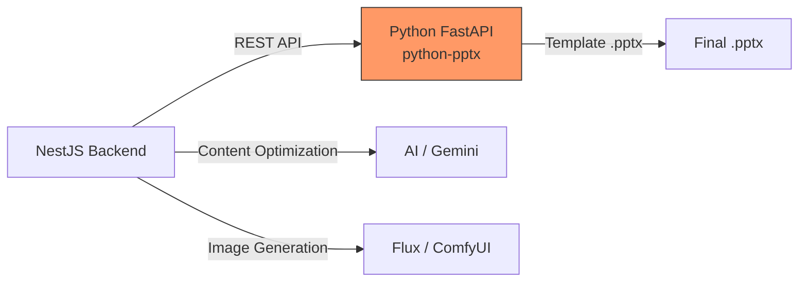
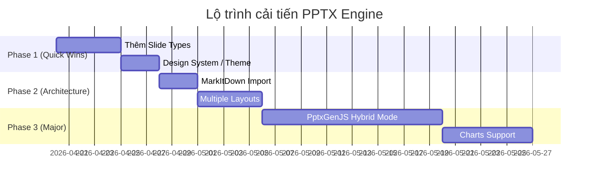

# 💡 Brainstorm: Cải Tiến Hệ Thống Tạo PPTX

**Mục tiêu:** So sánh kiến trúc tạo PPTX hiện tại của platform với 4 nguồn tham khảo, tìm ra cơ hội cải tiến thực tế.

---

## 1. Bản Đồ So Sánh Kiến Trúc

### Hệ thống hiện tại của mình



| Thành phần | Công nghệ | Vai trò |
|-----------|-----------|---------|
| PPTX Engine | `python-pptx` (Python) | Tạo file PowerPoint từ template |
| Orchestration | NestJS `PptxService` | Tối ưu content, sinh ảnh, gọi Python service |
| Template System | `.pptx` file + background images | Branding, layout |
| Communication | REST API (port 3002) | Backend → Python microservice |

### Bốn nguồn tham khảo

| Nguồn | Công nghệ chính | Cách tiếp cận | Điểm mạnh |
|-------|-----------------|---------------|-----------|
| **MiniMax Skill** | `PptxGenJS` (JS) + `markitdown` | Tạo PPTX thuần từ JS, mỗi slide = 1 file JS module | Design System hoàn chỉnh (theme, style recipes), QA process |
| **OpenAI Codex** | `python-pptx` (tương tự mình) | Agent tự viết code để edit/tạo slides | Slide-by-slide layout rules, AI-driven edits |
| **PptxGenJS** | `pptxgenjs` (JS thuần) | Thư viện JS tạo PPTX trực tiếp | Chạy mọi nơi (browser, Node, React), không cần Python, charts/tables/SVG |
| **MarkItDown** | Python converter | Chuyển PPTX → Markdown để AI đọc/phân tích | Đọc ngược file PPTX, OCR images trong slides |

---

## 2. Phân Tích GAP: Mình Có Gì, Thiếu Gì?

### ✅ Điểm mạnh của hệ thống hiện tại

| Khả năng | Mô tả |
|---------|-------|
| **Template-based generation** | Sử dụng template `.pptx` thật với background images → output chuyên nghiệp |
| **Auto-play audio embedding** | Nhúng audio + tự động phát khi trình chiếu (XML timing injection) |
| **AI Content Optimization** | 2-pass: Content Refinement → Image Generation |
| **Multi-provider TTS** | Gemini, Vbee, ViTTS OmniVoice |
| **Per-slide granular control** | User có thể làm lại 1 slide riêng lẻ |
| **SSE Real-time streaming** | Progress trực tiếp cho user trong quá trình gen |

### ❌ Điểm yếu / Thiếu sót

| Gap | Mô tả | Nguồn tham khảo |
|-----|-------|-----------------|
| **Phụ thuộc Python service** | Cần chạy riêng 1 Python container (port 3002), tăng phức tạp deploy | PptxGenJS chạy thuần JS, không cần service riêng |
| **Không có Design System** | Layout hardcoded trong `pptx_service.py`, không có theme object contract | MiniMax có cả Color Palette + Font + Style Recipes |
| **Không đọc ngược PPTX** | Không thể import/phân tích PowerPoint có sẵn của user | MarkItDown giải quyết được |
| **Layout cứng nhắc** | Chỉ có 2 layout: Title + Content (split/full). Thiếu TOC, Section Divider, Summary | MiniMax có 5 loại: Cover, TOC, Section Divider, Content, Summary |
| **Charts/Tables** | Không hỗ trợ biểu đồ, bảng trong slides | PptxGenJS hỗ trợ charts (bar, line, pie…), tables |
| **Không edit PPTX có sẵn** | Chỉ tạo mới, không sửa file PPTX đã có | MiniMax editing.md hướng dẫn XML manipulation |

---

## 3. Đề Xuất Cải Tiến — Xếp Hạng Theo Giá Trị

### 🔴 Ưu tiên CAO (High Impact, Achievable)

#### 3.1. Chuyển sang PptxGenJS — Loại bỏ Python service

> [!IMPORTANT]
> Đây là cải tiến chiến lược lớn nhất có thể thay đổi toàn bộ kiến trúc deploy.

| Khía cạnh | Hiện tại (python-pptx) | Đề xuất (PptxGenJS) |
|-----------|----------------------|---------------------|
| **Runtime** | Python microservice riêng | Chạy ngay trong NestJS (Node.js) |
| **Deploy** | 3 containers: backend, frontend, pptx-gen | 2 containers: backend+pptx, frontend |
| **Maintainability** | 2 ngôn ngữ (TS + Python) | 1 ngôn ngữ (TypeScript) |
| **Template** | `.pptx` template files | Code-defined themes + Slide Masters |
| **Charts** | ❌ Không hỗ trợ | ✅ Bar, Line, Pie, Doughnut, Scatter |
| **SVG** | ❌ Không hỗ trợ | ✅ Native SVG support |
| **Output** | File only | File, Buffer, Blob, Stream, base64 |
| **Audio embed** | ✅ XML injection | ⚠️ Cần tự inject XML (tương tự) |

**Rủi ro:**
- PptxGenJS **KHÔNG hỗ trợ load template .pptx có sẵn** — chỉ tạo mới từ code
- Phải build lại toàn bộ template system bằng JS (Slide Masters, backgrounds)
- Audio auto-play cần custom XML injection (cả 2 thư viện đều thiếu native)
- Cần effort lớn: **~2-3 tuần**

**Phương án lai (Hybrid — KHUYẾN NGHỊ):**
```
Giữ python-pptx cho template-based generation hiện tại
+ Thêm PptxGenJS cho "Quick Create" mode (không cần template)
```
→ User chọn: "Dùng template có sẵn" vs "Tạo nhanh (AI design)"

#### 3.2. Thêm Slide Types (Cover, TOC, Section Divider, Summary)

Hiện tại chỉ có 2 loại: **Title** + **Content**. Theo kiến trúc MiniMax, một bài giảng chuyên nghiệp cần:

| Loại slide | Mục đích | Hiện tại |
|-----------|---------|----------|
| **Cover** | Trang bìa với tiêu đề bài giảng | ✅ Có (Title slide) |
| **TOC / Agenda** | Mục lục các phần | ⚠️ Dùng content slide, chưa chuyên biệt |
| **Section Divider** | Trang chuyển phần (giữa các topic) | ❌ Hoàn toàn thiếu |
| **Content** | Nội dung chính | ✅ Có |
| **Summary / Kết luận** | Tóm tắt cuối cùng | ❌ Dùng content slide bình thường |

**Effort:** ~3-5 ngày. Sửa `pptx_service.py` thêm layouts + sửa prompt AI để tag `slideType`.

#### 3.3. Design System cho Template

Học hỏi từ MiniMax, tạo một **Theme Object Contract** cho hệ thống:

```typescript
interface PptxTheme {
  primary: string;    // Màu chủ đạo (tiêu đề)
  secondary: string;  // Màu phụ (body text)
  accent: string;     // Điểm nhấn
  light: string;      // Nền nhạt
  bg: string;         // Background

  fontTitle: string;     // Font tiêu đề
  fontBody: string;      // Font nội dung
  fontCode?: string;     // Font code (nếu có)

  style: 'sharp' | 'soft' | 'rounded' | 'pill'; // Border radius style
}
```

Lưu vào DB (SystemConfig hoặc Template metadata) → Phục vụ cả PptxGenJS lẫn python-pptx.

---

### 🟡 Ưu tiên TRUNG BÌNH

#### 3.4. Tích hợp MarkItDown — Import PPTX có sẵn

Cho phép user upload file PPTX đã có → chuyển thành Markdown → AI phân tích → tạo bài giảng mới.

```
User uploads existing.pptx
    → MarkItDown converts to Markdown
    → AI analyzes structure + content
    → System creates new lesson with slides pre-populated
```

**Use case thực tế cho giảng viên:**
- "Tôi có file PowerPoint cũ, muốn nâng cấp thành bài giảng tự động có audio"
- "Tôi muốn trích xuất nội dung từ slide để tạo câu hỏi kiểm tra"

**Effort:** ~2-3 ngày. `pip install markitdown[pptx]` → endpoint mới `/api/pptx/import`.

#### 3.5. Hỗ trợ Charts / Biểu đồ trong Slides

Hiện tại slides thuần text + images. Với dữ liệu số, charts sẽ nâng tầm bài giảng:

- AI phân tích nội dung → detect data tables/statistics → auto-generate chart
- Template: `slideType: 'chart'` with data payload
- PptxGenJS hỗ trợ native: BAR, LINE, PIE, DOUGHNUT

**Effort:** ~1 tuần (cần PptxGenJS hoặc python-pptx chart API).

#### 3.6. Multiple Layout Patterns cho Content Slides

Thay vì chỉ 2 layout (full-width vs split), thêm:

| Layout | Mô tả |
|--------|-------|
| `two-column` | 2 cột text song song |
| `image-left` | Ảnh trái, text phải (nghịch hiện tại) |
| `full-image` | Ảnh full slide + overlay text |
| `comparison` | So sánh 2 concepts |
| `timeline` | Dòng thời gian |
| `quote` | Câu trích dẫn nổi bật |

AI prompt sẽ suggest layout phù hợp cho từng slide dựa trên nội dung.

---

### 🟢 Ưu tiên THẤP (Nice-to-have)

#### 3.7. Edit PPTX Có Sẵn (XML Manipulation)

Theo hướng dẫn MiniMax `editing.md`: unzip PPTX → sửa XML → repack.
Phức tạp, nhiều edge cases — chỉ nên cân nhắc khi có nhu cầu rõ ràng.

#### 3.8. Export PDF/Video từ PPTX

Chuyển PPTX → PDF hoặc video bài giảng (slide + audio synchronized).
Cần LibreOffice headless hoặc công cụ bên thứ 3. Effort cao.

#### 3.9. Browser-side Preview (PptxGenJS)

Dùng PptxGenJS ở frontend để render preview trước khi download.
Giảm tải server, user thấy kết quả real-time.

---

## 4. Lộ Trình Đề Xuất



---

## 5. Kết Luận & Câu Hỏi Cần Trả Lời

> [!NOTE]
> Hệ thống hiện tại đã rất mature ở phần template-based generation + audio embedding. Các cải tiến nên tập trung vào **đa dạng hóa layout** và **giảm phức tạp deploy** thay vì viết lại từ đầu.

### Câu hỏi cho anh:

1. **PptxGenJS Hybrid**: Anh có muốn thêm mode "Tạo nhanh không cần template" (PptxGenJS) song song với hệ thống template hiện tại? Hay anh muốn giữ nguyên python-pptx?

2. **Import PPTX**: Giảng viên của anh có nhu cầu upload PowerPoint cũ để nâng cấp không? Nếu có, MarkItDown là quick win.

3. **Slide Types**: Anh muốn ưu tiên thêm loại slide nào trước? Em nghĩ **Section Divider** là quan trọng nhất (tách chương/phần rõ ràng trong bài giảng dài).

4. **Charts**: Bài giảng của anh có nhiều dữ liệu số cần biểu đồ không?
