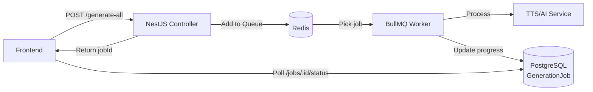
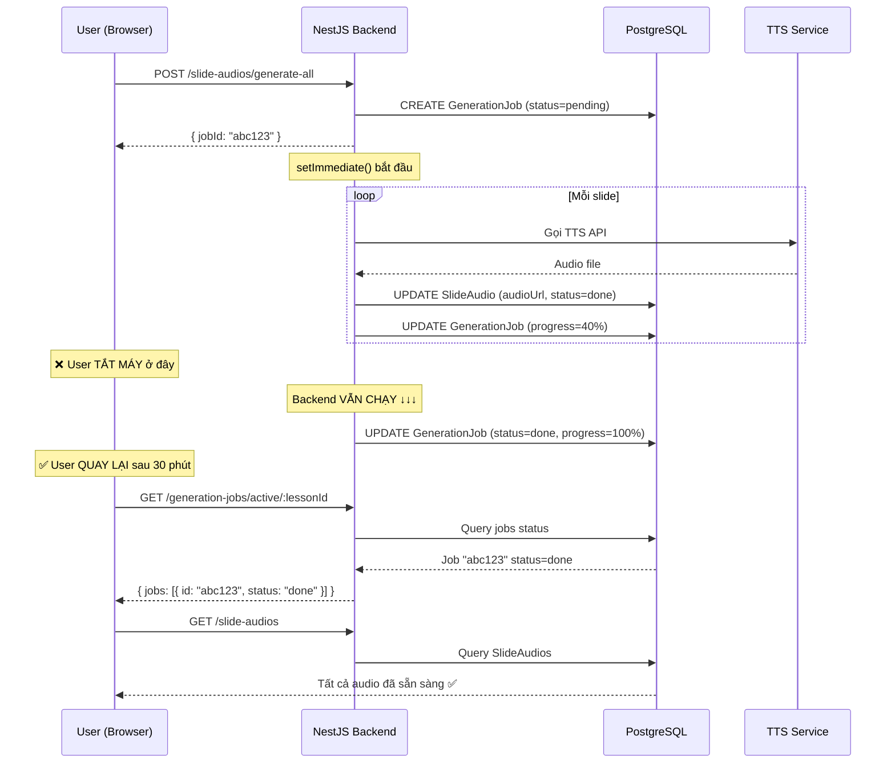
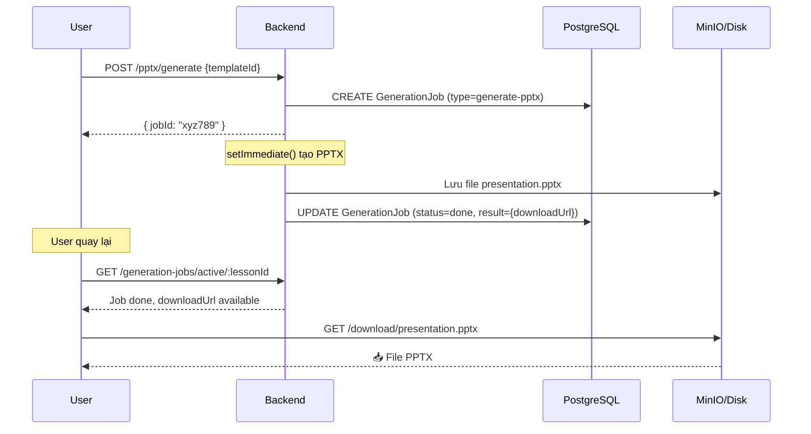

# 💡 BRAINSTORM & TECHNICAL RESEARCH v2: Resilient Background Processing

**Ngày cập nhật:** 2026-05-31
**Chủ đề:** Chuyển đổi các tác vụ nặng sang chạy nền — User tắt máy, khi quay lại F5 là thấy kết quả.
**Ràng buộc:** Schema DB giữ nguyên. Luồng dữ liệu lưu DB không thay đổi.

---

## 1. PHÂN TÍCH HIỆN TRẠNG

### 1.1. Các tác vụ đã chạy ngầm (OK) ✅
Các bước sau đã dùng `setImmediate()` + `GenerationJob` + `useJobPolling`:
- Step 2: Tạo Outline Chi Tiết
- Step 3: Kịch Bản Slide (generate)
- Step 4: Tạo Lời Giảng RAW & Tối Ưu
- Step 6: Ngân Hàng Câu Hỏi

**Vấn đề còn lại:** Khi user reload/F5, frontend mất `jobId` → không biết backend vẫn đang chạy.

### 1.2. Các tác vụ CHƯA chạy ngầm (CẦN SỬA) ❌

| Tác vụ | Hiện trạng | Vấn đề |
|:---|:---|:---|
| **Tạo Audio tất cả slide** | Frontend loop gọi API tuần tự từng slide | Nếu tắt tab → dừng hoàn toàn, phải bấm lại |
| **Tạo nội dung + ảnh PPTX** | Frontend loop gọi API tuần tự từng slide | Tương tự, mất tiến trình khi tắt tab |
| **Tạo file PPTX** | HTTP POST chờ buffer trả về | Cloudflare timeout 524, file nặng timeout |

### 1.3. Frontend "Generate All" hiện tại

Cả Step 4 (Audio) và Step 5 (PPTX content+images) đều dùng **cùng pattern**:
```
Frontend: for (slide of slides) {
    await api.post(`/slides/${idx}/generate`)  // Chờ từng slide
    await delay(2500)
}
```
→ Vòng lặp chạy **ở browser**, tắt tab = dừng. Backend chỉ xử lý đơn lẻ 1 slide/request.

---

## 2. NGHIÊN CỨU CÔNG NGHỆ

### 2.1. So sánh 3 phương án queue

| Tiêu chí | **Phương án A:**<br/>DB Polling<br/>(GenerationJob hiện tại) | **Phương án B:**<br/>BullMQ + Redis | **Phương án C:**<br/>pg-boss |
|:---|:---|:---|:---|
| **Hạ tầng cần thêm** | Không cần | Redis (**đã có** trong docker-compose) | Không cần (dùng PostgreSQL sẵn) |
| **Nỗ lực code** | 🟢 Thấp nhất<br/>Giữ nguyên pattern hiện tại | 🟡 Trung bình<br/>Cần cài @nestjs/bullmq, tạo workers | 🟡 Trung bình<br/>Cần cài pg-boss, tạo wrappers |
| **Khôi phục khi restart** | ❌ `setImmediate` mất khi restart | ✅ Redis giữ queue, worker tự resume | ✅ PostgreSQL giữ job, worker tự resume |
| **Concurrency control** | ❌ Tự code | ✅ Built-in (configurable workers) | ✅ Built-in |
| **Rate limiting** | ❌ Tự code | ✅ Built-in | ⚠️ Cơ bản |
| **Retry tự động** | ❌ Tự code | ✅ Built-in (backoff strategies) | ✅ Built-in |
| **NestJS integration** | ✅ Đã có sẵn | ✅ Official `@nestjs/bullmq` | ⚠️ Community, cần wrapper |
| **Throughput** | Đủ dùng (~10-50 jobs/giờ) | Rất cao (5k+ jobs/sec) | Trung bình |
| **Phù hợp dự án** | ✅ Nhanh triển khai ngay | ✅ Chuyên nghiệp nhất | ⚠️ Ít lợi thế so với A |

### 2.2. Đánh giá chi tiết

#### Phương án A: Giữ setImmediate + cải tiến GenerationJob
```
Ưu điểm: Zero code mới, chỉ cần di chuyển vòng lặp từ frontend → backend
Nhược điểm: Restart server = mất job đang chạy (nhưng data đã lưu DB vẫn còn)
```
**Cách hoạt động:**
1. Frontend gọi `POST /slide-audios/generate-all` → Backend tạo `GenerationJob`, trả `jobId` ngay
2. Backend `setImmediate()` chạy vòng lặp sinh audio từng slide
3. Frontend dùng `useJobPolling` theo dõi tiến trình
4. User tắt tab → Backend vẫn chạy → User quay lại F5 → Thấy kết quả đã hoàn thành

**Risk:** Nếu server restart giữa chừng → job mất. Nhưng dữ liệu (audio files, slide data) đã lưu vào DB/disk vẫn còn nguyên. User chỉ cần bấm "Tiếp tục tạo" cho các slide chưa xong.

#### Phương án B: BullMQ + Redis
```
Ưu điểm: Production-grade, restart-safe, concurrency control
Nhược điểm: Cần cài thêm packages, thay đổi architecture
```
**Cách hoạt động:**
1. Frontend gọi API → Backend add job vào Redis Queue
2. BullMQ Worker tự động pick job, xử lý
3. Worker cập nhật `GenerationJob` trong DB (giữ nguyên schema)
4. Frontend polling `GenerationJob` như cũ


```mermaid
graph LR
    FE[Frontend] -->|POST /generate-all| API[NestJS Controller]
    API -->|Add to Queue| Redis[(Redis)]
    API -->|Return jobId| FE
    Redis -->|Pick job| Worker[BullMQ Worker]
    Worker -->|Process| TTS[TTS/AI Service]
    Worker -->|Update progress| DB[(PostgreSQL<br/>GenerationJob)]
    FE -->|Poll /jobs/:id/status| DB
```

#### Phương án C: pg-boss
```
Ưu điểm: Dùng PostgreSQL sẵn có, ACID transactions
Nhược điểm: Ít community support NestJS, tương tự setImmediate đã có
```
**Đánh giá:** Với dự án này (~10-50 jobs/giờ), pg-boss không mang lại lợi thế đáng kể so với Phương án A (đã có GenerationJob table tương đương). Chỉ nên dùng nếu cần transactional integrity rất cao.

---

## 3. ĐỀ XUẤT: 2 GIAI ĐOẠN TRIỂN KHAI

### 🚀 Giai đoạn 1: Quick Win — Đưa vòng lặp về backend (Phương án A)
**Thời gian:** ~2-3 ngày | **Nỗ lực:** Thấp | **Hiệu quả:** Rất cao

#### Backend changes:
1. **Endpoint mới:** `GET /generation-jobs/active/:lessonId` — Trả danh sách jobs đang chạy cho lesson
2. **Di chuyển "Generate All Audio" về backend:**
   - Endpoint `POST /slide-audios/generate-all` → tạo `GenerationJob`, trả `jobId`
   - `setImmediate()` chạy vòng lặp sinh audio (giữ nguyên logic `generateSingleAudio`)
   - Cập nhật `jobService.updateProgress()` sau mỗi slide
3. **Di chuyển "Generate PPTX Content+Images" về backend:**
   - Endpoint `POST /slides/generate-all-content` → tạo `GenerationJob`, trả `jobId`
   - `setImmediate()` chạy vòng lặp optimize + image cho từng slide
4. **PPTX file generation:**
   - `POST /pptx/generate` → tạo `GenerationJob`, sinh file, lưu MinIO/disk
   - Khi xong: `result: { downloadUrl: '...' }`
   - Endpoint mới `GET /pptx/download/:lessonId` để tải file tĩnh

#### Frontend changes:
1. **Auto-Resume khi reload:**
   - Mỗi Step component mount → gọi `GET /generation-jobs/active/:lessonId`
   - Nếu có job `processing` phù hợp type → tự `startPolling(jobId)`
2. **Step 4:** Thay vòng lặp frontend bằng 1 API call → poll tiến trình
3. **Step 5:** Thay vòng lặp frontend bằng 1 API call → poll tiến trình
4. **Step 5 PPTX:** Thay fetch blob bằng poll → hiện nút download khi xong

---

### 🏗️ Giai đoạn 2: BullMQ Queue (Phương án B) — Optional upgrade
**Thời gian:** ~3-5 ngày | **Khi nào làm:** Khi cần scale hoặc restart-safe

#### Thay đổi:
1. Cài `@nestjs/bullmq`, tạo `QueueModule`
2. Thay `setImmediate()` bằng `queue.add(jobName, payload)`
3. Tạo Worker classes cho mỗi loại job
4. Workers vẫn ghi vào `GenerationJob` table → Frontend KHÔNG cần thay đổi

**Lợi ích thêm:**
- Server restart → Redis giữ queue → Worker tự tiếp tục
- Concurrency limit: chỉ cho 2 job AI chạy đồng thời
- Retry: tự thử lại 3 lần nếu TTS timeout

---

## 4. SƠ ĐỒ LUỒNG DỮ LIỆU SAU CẢI TIẾN

### Flow: User bấm "Tạo Audio tất cả" → Tắt máy → Quay lại


```mermaid
sequenceDiagram
    participant U as User (Browser)
    participant API as NestJS Backend
    participant DB as PostgreSQL
    participant TTS as TTS Service

    U->>API: POST /slide-audios/generate-all
    API->>DB: CREATE GenerationJob (status=pending)
    API-->>U: { jobId: "abc123" }
    Note over API: setImmediate() bắt đầu

    loop Mỗi slide
        API->>TTS: Gọi TTS API
        TTS-->>API: Audio file
        API->>DB: UPDATE SlideAudio (audioUrl, status=done)
        API->>DB: UPDATE GenerationJob (progress=40%)
    end

    Note over U: ❌ User TẮT MÁY ở đây
    Note over API: Backend VẪN CHẠY ↓↓↓

    API->>DB: UPDATE GenerationJob (status=done, progress=100%)

    Note over U: ✅ User QUAY LẠI sau 30 phút

    U->>API: GET /generation-jobs/active/:lessonId
    API->>DB: Query jobs status
    DB-->>API: Job "abc123" status=done
    API-->>U: { jobs: [{ id: "abc123", status: "done" }] }

    U->>API: GET /slide-audios
    API->>DB: Query SlideAudios
    DB-->>U: Tất cả audio đã sẵn sàng ✅
```

### Flow: PPTX file generation


```mermaid
sequenceDiagram
    participant U as User
    participant API as Backend
    participant DB as PostgreSQL
    participant S3 as MinIO/Disk

    U->>API: POST /pptx/generate {templateId}
    API->>DB: CREATE GenerationJob (type=generate-pptx)
    API-->>U: { jobId: "xyz789" }

    Note over API: setImmediate() tạo PPTX

    API->>S3: Lưu file presentation.pptx
    API->>DB: UPDATE GenerationJob (status=done, result={downloadUrl})

    Note over U: User quay lại

    U->>API: GET /generation-jobs/active/:lessonId
    API-->>U: Job done, downloadUrl available
    U->>S3: GET /download/presentation.pptx
    S3-->>U: 📥 File PPTX
```

---

## 5. DANH SÁCH CÁC ENDPOINT CẦN THAY ĐỔI

### Backend (Thêm/Sửa):

| Endpoint | Thay đổi | Mô tả |
|:---|:---|:---|
| `GET /generation-jobs/active/:lessonId` | **MỚI** | Trả danh sách jobs đang chạy/vừa xong |
| `POST /slide-audios/generate-all` | **SỬA** | Chuyển từ sync → async job |
| `POST /slides/generate-all-content` | **MỚI** | Backend loop tạo content+image cho tất cả slides |
| `POST /pptx/generate` | **SỬA** | Chuyển từ sync stream → async job + static file |
| `GET /pptx/download/:lessonId` | **MỚI** | Tải file PPTX tĩnh đã được sinh |

### Frontend (Thay đổi):

| Component | Thay đổi |
|:---|:---|
| `Step4GenerateAudio.tsx` | Thay vòng lặp `generateAllAudios` bằng 1 API call + `useJobPolling` |
| `Step5GeneratePPTX.tsx` | Thay vòng lặp `handleGenerateContent` bằng 1 API call + `useJobPolling` |
| `Step5GeneratePPTX.tsx` | Thay `handleGeneratePptx` (fetch blob) bằng poll + download link |
| Mỗi Step component | Thêm `useEffect` gọi `/active/:lessonId` để auto-resume |

---

## 6. CÂU HỎI MỞ ĐỂ THẢO LUẬN

> [!IMPORTANT]
> **Q1:** Anh muốn triển khai Giai đoạn 1 (Quick Win, setImmediate) trước? Hay muốn đi thẳng BullMQ luôn?
> 
> **Đề xuất:** Giai đoạn 1 trước vì:
> - Nhanh triển khai (~2-3 ngày)
> - Schema DB giữ nguyên
> - Frontend chỉ cần sửa nhẹ (thay loop → poll)
> - Giải quyết 95% vấn đề UX (tắt tab vẫn chạy)
> - Giai đoạn 2 (BullMQ) có thể làm sau, frontend KHÔNG cần sửa lại

> [!NOTE]
> **Q2:** File PPTX tĩnh nên lưu ở đâu?
> - **A)** Lưu trên disk `/uploads/exports/` (đơn giản, nhanh)
> - **B)** Lưu trên MinIO S3 (chuyên nghiệp hơn, nhưng cần cấu hình)
> 
> Hiện tại MinIO đã dùng cho audio files → đề xuất dùng MinIO luôn cho consistency.

> [!NOTE]
> **Q3:** Có cần chính sách tự động xóa file PPTX cũ (retention policy) không?
> Ví dụ: xóa file PPTX export sau 7 ngày để tiết kiệm dung lượng VPS.
